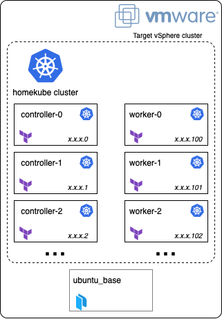

# HomeKube Terrafrorm

An opinionated infrastructure as code homelab kubernetes cluster on vSphere.

## Background

Usually spinning up a kubernetes cluster within a non-enterprise "on premises" environment such as homelab involves a fair bit of manual work. This project aims to automate as many steps as possible in this process so that one spends less time on the infrastructure and more time on kubernetes itself. In addition to that this is also a great opportunity to learn how to bridge the gap between homelabs and current offerings within the cloud.

## What you get

Homekube-terraform allows you to provision a Kubernetes cluster with a configurable number of Control-plane and worker nodes using terraform based on a "base image" created by Packer. Each node is a VM created in the target vSphere cluster and configured via Terraform and an optional bootstrap script.

<p align="center" style="text-align:center;">
    
</p>

## Prerequisites

This is an opinionated setup because it is tailored to my homelab. As a result there are a bunch of prerequisites that need to be in place for the terraform code to work. Hopefully I will eventually manage to make the dependencies vendor agnostic in a way that allows anyone to configre their homelab and then use the code from this project, but this is not the case yet.

### Local Software

There is some software required locally for the whole automation to run.

Terraform:

* Terraform

Packer:

* Packer
* VMware Workstation / Fusion
* ovftool
* Debian system (used to generate the hash of the password for the template VM)

### Networking

I am using PfSense as my router and firerwall. Therefore the networking prerequisites are documented for PfSense specifically. Aditionally this automation assumes a `/24` subnet of your choice is available and routable.

See: [Network config](docs/pfsense.md)

### Hypervisor

I am using vSphere as my hypervisor. This is really a prerequisite for doing proper infrastructure as code for VMWare products. I could use a workaround such as [this](https://github.com/josenk/terraform-provider-esxi) ESXi provider, or Proxmox but my personal preference is to use tools that are widely used in enterprises. Also its not really a homelab if it isn't overkill right?

Details on how to set up your vSphere hypervisor can be found [here](docs/vsphere.md).

### VM template creation

Spinning up VMs from scratch and installing an OS on them is a very expensive process. This is why we will be creating a base template for our VMs that we will reuse accross all our nodes and configure according to our needs. This process is already common within cloud envronments for multiple reasons such as boot time and security.

More details about process for creating a reusable image can be found [here](docs/vm-template.md).

### Certificate Authority

Having a pre-created Certificate Authortiy allows us to create users for our clusters without having to log in to it first. This makes it easier to automate any further actions executed by the potential users of our cluster.

More details on how to set up your own CA can be found [here](docs/ca.md).

## Configuration

Here is an overview of what can be configured.

### Bootstrap script

A bootstrap script is placed on the base image used by all nodes during the Packer image creation process. This scirpt can be populated according to individual needs.

Example script can be found [here](packer/scripts/bootstrap-example.sh).

### Terraform

Terraform exposes a few configuration options. Those are detailed in the variables file.

## Running locally

After all the prerequisites have been configured, all you need to do is run Terraform with the correct parameters.

Env vars required

```bash
export VSPHERE_USER="terraform"
export VSPHERE_PASSWORD=""
export VSPHERE_SERVER="" # Must match vcenter_server in packer
export TF_VAR_vm_ssh_username="" # Must match vm_ssh_username in packer
export TF_VAR_vm_ssh_password="" # Must match vm_ssh_password in packer
export TF_VAR_datacenter_name="" # Must match datacenter_name in packer
export TF_VAR_datastore_name=""
export TF_VAR_cluster_name=""
export TF_VAR_network_name=""
export TF_VAR_target_subnet=""
export TF_VAR_discovery_token_ca_cert_hash=$(openssl x509 -in ca/kubernetes-ca/kubernetes-ca.pem -pubkey -noout | openssl pkey -pubin -outform DER | openssl dgst -sha256)
```

Once the variables are configured, simply run Terraform.

```bash
cd terraform
terraform init
terraform apply
```
