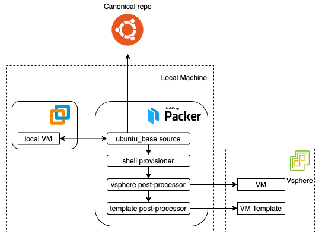

# VM Template

Having a VM template in ESXi abstracts the process of creating a secure and usable base layer for all the machines in our cluster from the actual process of setting up and configuring Kubernetes. Hence we achive a sort of separation of responsibilities simmilar to what we see in the cloud. On a side note this also allows me to run other services on their own VMs with minimal configuration in my homelab.

When creating an ESXi VM via Terraform one has a few options for specifing a pre-configured image. In this project I am using VM template cloning. This is why a VM template representing our base VM (image) should already be present before we can invoke our terraform scripts.

There are two options for creating such a template VM. One is to create that manually and the second is using the packer scripts provided as part of this project. The first is out of scope for the purposes of this project, but the packer method will be described below.

## Template creation

When the quirks of setting up packer are set aside, the process for creating a VM template is fairly straightforward.

    

## Creating the template VM

More details on creating your template VM can be found [here](../packer/README.md).
